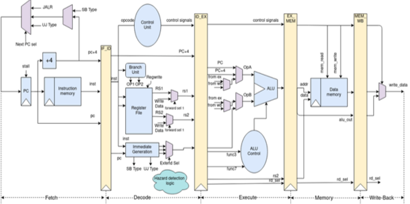
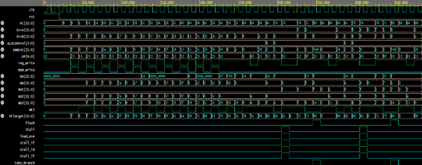
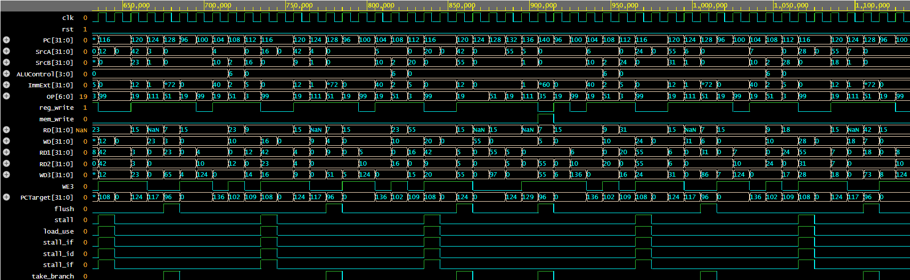

# RISC-V Pipelined Processor Using Verilog

## Overview

This project presents the design and implementation of a **32-bit Five-Stage Pipelined RISC-V Processor** using Verilog HDL based on the RV32I Instruction Set Architecture.

The processor improves performance by allowing multiple instructions to execute simultaneously across five pipeline stages:

- Instruction Fetch (IF)
- Instruction Decode (ID)
- Execute (EX)
- Memory Access (MEM)
- Write Back (WB)

To ensure correct execution in a pipelined environment, the design incorporates a **Forwarding Unit** and **Hazard Detection Unit** for handling data and control hazards efficiently.

The processor was verified using a dedicated Verilog testbench and successfully executed arithmetic, logical, memory, branch, jump, and immediate instructions.


---

## Features

- 32-Bit RV32I RISC-V Processor
- Five-Stage Pipeline Architecture
- Instruction Fetch (IF)
- Instruction Decode (ID)
- Execute (EX)
- Memory Access (MEM)
- Write Back (WB)
- Hazard Detection Unit
- Forwarding Unit
- Branch Handling Logic
- Pipeline Registers
- Load and Store Support
- Branch and Jump Instructions
- Immediate Instruction Support
- Verilog Testbench Verification

---

## Supported Instructions

### R-Type Instructions

- ADD
- SUB
- AND
- OR
- XOR
- SLT
- SLL
- SRL
- SRA

### I-Type Instructions

- ADDI
- ANDI
- ORI
- XORI
- SLTI
- SLLI
- SRLI
- SRAI
- LW
- JALR

### S-Type Instructions

- SW

### B-Type Instructions

- BEQ
- BNE
- BLT
- BGE

### U-Type Instructions

- LUI

### J-Type Instructions

- JAL

### Total Supported Instructions

```text
26 RV32I Instructions
```

---

## System Architecture

The processor consists of the following major modules:

- Program Counter (PC)
- Instruction Memory
- Register File
- Control Unit
- Sign Extension Unit
- ALU
- Data Memory
- Pipeline Registers
- Forwarding Unit
- Hazard Detection Unit
- PC+4 Adder
- PC Target Adder
- Multiplexers



---

## Pipeline Execution Flow

Every instruction passes through the following five stages:

```text
Instruction Fetch
        ↓
Instruction Decode
        ↓
Execute
        ↓
Memory Access
        ↓
Write Back
```


---

## Instruction Formats

The processor supports all major RV32I instruction formats.

| Format | Purpose |
|----------|----------|
| R-Type | Register Operations |
| I-Type | Immediate and Load Operations |
| S-Type | Store Operations |
| B-Type | Branch Instructions |
| U-Type | Upper Immediate Instructions |
| J-Type | Jump Instructions |

---

## Major Modules

### Program Counter (PC)

Stores the address of the current instruction being executed.

### Instruction Memory

Stores machine code instructions and provides instructions based on the PC value.

### Register File

Contains 32 general-purpose 32-bit registers with two read ports and one write port.

### Arithmetic Logic Unit (ALU)

Performs arithmetic, logical, comparison, and shift operations.

### Control Unit

Generates control signals required for instruction execution.

### Sign Extension Unit

Generates immediate values for I-Type, S-Type, B-Type, U-Type, and J-Type instructions.

### Data Memory

Handles load and store operations.

### Pipeline Registers

The processor contains four pipeline registers:

- IF/ID
- ID/EX
- EX/MEM
- MEM/WB

### Forwarding Unit

Provides data forwarding to reduce pipeline stalls.

### Hazard Detection Unit

Detects load-use and control hazards.

---

## Testbench

A dedicated Verilog testbench was developed to verify processor functionality.

### Testbench Features

- Clock Generation
- Reset Verification
- Arithmetic Instruction Verification
- Logical Instruction Verification
- Load/Store Verification
- Branch Verification
- Jump Verification
- Hazard Verification
- Pipeline Verification

---

## Simulation Results

The processor was tested using individual instruction verification and a complete application program for finding the maximum value in an array.








---

## Sample Register Values from Simulation

| Register | Value |
|-----------|---------|
| x0 | 0 |
| x1 | 10 |
| x2 | 10 |
| x3 | 0 |
| x4 | 60 |
| x5 | 36 |
| x6 | 36 |
| x7 | 27 |
| x8 | 0 |
| x9 | 0 |
| x10 | 0 |

### Memory Contents

| Memory Location | Value |
|-----------------|---------|
| mem0 | 15 |
| mem1 | 7 |
| mem2 | 42 |
| mem3 | 23 |
| mem4 | 9 |
| mem5 | 55 |
| mem6 | 31 |
| mem7 | 18 |
| mem8 | 60 |
| mem9 | 27 |
| mem10 | 60 |

### Final Result

```text
Maximum Value Found = 60
Stored at Memory Location 10
```

---


---


## Report

For detailed architecture, hazard handling, forwarding logic, instruction execution, simulation analysis, challenges, and learnings, refer to:

```text
Report/PIPELINED_RISC-V.pdf
```

---

## Author

**Nensi Thummar**

Electronics and Communication Engineering

Nirma University
